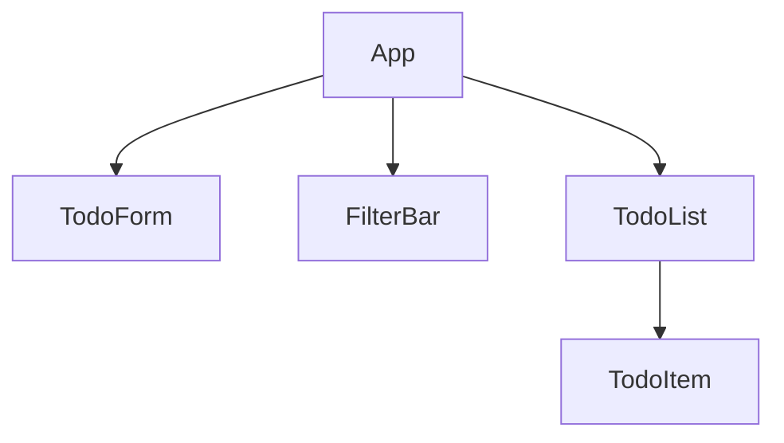
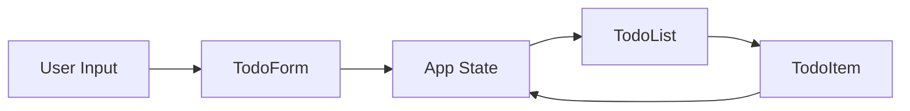
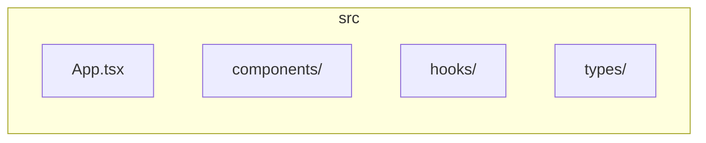

# React Todo List

## Table of Contents

- [Overview](#overview)
- [Architecture](#architecture)
- [Component Hierarchy](#component-hierarchy)
- [State Management](#state-management)
- [Data Flow](#data-flow)
- [File Structure](#file-structure)
- [Getting Started](#getting-started)
- [Development](#development)

---

## Overview

A React-based todo list application demonstrating clean architecture patterns, unidirectional data flow, and reusable component design. The app supports adding, completing, filtering, and deleting todos with persistent storage options.

**Tech Stack:** React, TypeScript, modern hooks (useState, useContext)

---

## Architecture

The application follows a layered architecture with unidirectional data flow:

```
┌─────────────────────────────────────────────────────────────┐
│                     Presentation Layer                      │
│  (App, TodoList, TodoItem, TodoForm, FilterBar components)   │
└─────────────────────────────────────────────────────────────┘
                              │
                              ▼
┌─────────────────────────────────────────────────────────────┐
│                    State Management Layer                    │
│         (useState, Context, or external store)               │
└─────────────────────────────────────────────────────────────┘
                              │
                              ▼
┌─────────────────────────────────────────────────────────────┐
│                      Data / Persistence                      │
│              (localStorage, API, or in-memory)               │
└─────────────────────────────────────────────────────────────┘
```

- **Presentation Layer**: Renders UI and captures user input
- **State Management Layer**: Holds todos and filter state; exposes update handlers
- **Data / Persistence**: Optional persistence via localStorage, API, or in-memory store

---

## Component Hierarchy



| Component   | Responsibility                                 |
|------------|-------------------------------------------------|
| **App**    | Root component; owns state, provides context   |
| **TodoForm** | Input for new todos; submits on add           |
| **FilterBar** | Toggles filter: all / active / completed      |
| **TodoList** | Renders list of TodoItem components           |
| **TodoItem** | Single todo row; toggle complete, delete      |

---

## State Management

### Data Shape

```typescript
interface Todo {
  id: string;
  text: string;
  completed: boolean;
  createdAt: Date;
}

type Filter = 'all' | 'active' | 'completed';
```

### Update Patterns

- **Add**: Append new todo with `id`, `text`, `completed: false`, `createdAt`
- **Toggle**: Map over todos, flip `completed` for matching `id`
- **Delete**: Filter out todo by `id`
- **Filter**: Derive visible list from `todos` and `filter` value

### Component Props

```typescript
interface TodoItemProps {
  todo: Todo;
  onToggle: (id: string) => void;
  onDelete: (id: string) => void;
}
```

---

## Data Flow



1. **User** enters text in TodoForm → `onAdd` → App state updates
2. **User** clicks filter → FilterBar → App state updates `filter`
3. **App** passes `todos` and handlers to TodoList → TodoItem
4. **User** toggles/ deletes in TodoItem → Handler → App state updates
5. State changes cause re-render down the tree

---

## File Structure



```
src/
├── App.tsx              # Root component, state & context
├── components/
│   ├── TodoForm.tsx     # Add todo input
│   ├── TodoList.tsx     # List container
│   ├── TodoItem.tsx     # Single todo row
│   └── FilterBar.tsx    # Filter controls
├── hooks/
│   └── useTodos.ts      # Optional custom hook for todo logic
└── types/
    └── todo.ts          # Todo, Filter interfaces
```

---

## Getting Started

### Prerequisites

- Node.js 18+
- npm or yarn

### Install

```bash
npm install
```

### Run

```bash
npm start
```

---

## Development

### Build

```bash
npm run build
```

### Test

```bash
npm test
```

---

*Architecture documentation based on plan files: `01-overview-and-skeleton.md`, `02-populate-architecture-content.md`*
