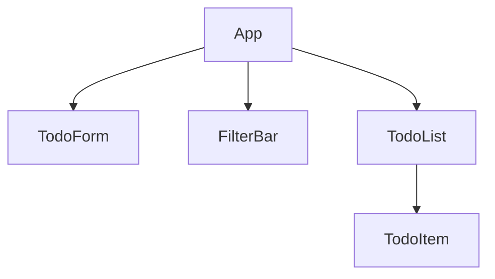
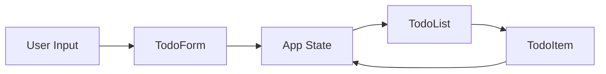
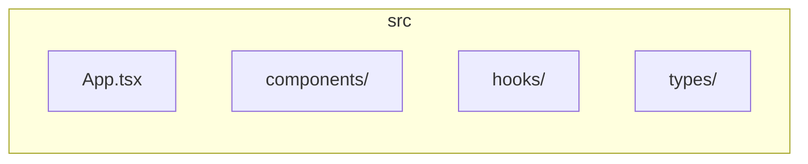

# Plan 02: Populate Architecture Content

## 1. Goal

Populate README.md with full architecture documentation: overview text, component hierarchy, state management patterns, data flow, mermaid diagrams, file structure, and development setup.

## 2. Acceptance Criteria

- [ ] Overview section describes React todo list purpose and tech stack
- [ ] Architecture section includes at least one mermaid diagram
- [ ] Component Hierarchy documents App, TodoList, TodoItem, TodoForm, FilterBar
- [ ] State Management describes data shape and update patterns
- [ ] Data Flow section includes sequence or flowchart diagram
- [ ] File Structure section shows directory layout
- [ ] Getting Started has install and run commands
- [ ] Development section has build/test commands
- [ ] All mermaid diagrams render correctly in GitHub/GitLab

## 3. Files to Modify

| File | Action | Purpose |
|------|--------|---------|
| README.md | Update | Add architecture content, diagrams, and instructions |

## 4. Code Examples

### State Shape

```typescript
interface Todo {
  id: string;
  text: string;
  completed: boolean;
  createdAt: Date;
}

type Filter = 'all' | 'active' | 'completed';
```

### Component Props

```typescript
interface TodoItemProps {
  todo: Todo;
  onToggle: (id: string) => void;
  onDelete: (id: string) => void;
}
```

## 5. Mermaid Diagrams (include in README)

### Component Hierarchy



### Data Flow



### File Structure



## 6. Commit Message

```
docs: add React todo list architecture documentation
```
